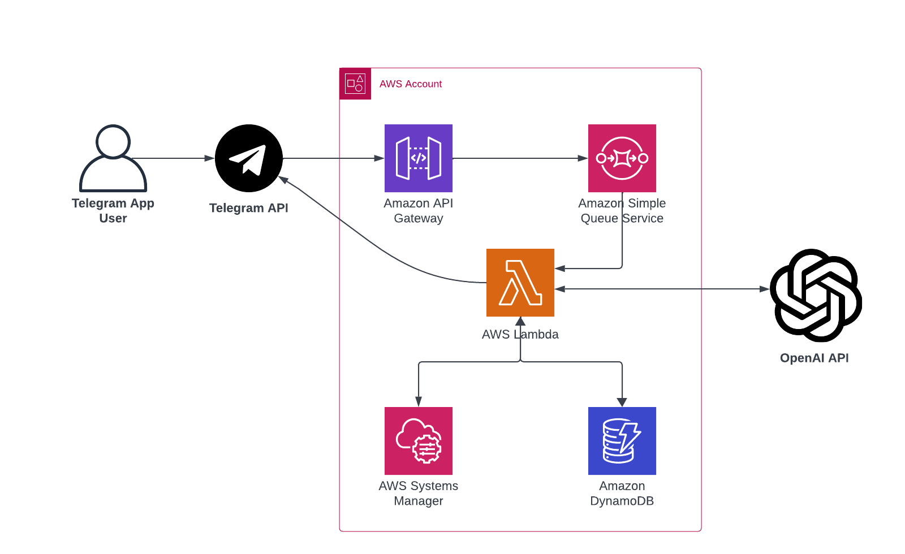

# AWS Telegram AI Module

## Project Description

The AWS Telegram AI Module is a project designed to seamlessly integrate an AI assistant with a Telegram chatbot. Utilizing the capabilities of the new OpenAI API, this project enables users to interact with an advanced AI model directly through Telegram. The module is particularly useful for creating specialized assistants, such as a math tutor, language teacher, or general-purpose chatbot.

## Architecture Diagram

Below is a diagram illustrating the overall architecture:



## Requirements

- AWS Account
- Telegram Bot Token
- OpenAI API Key
- Terraform installed on your local machine

## Deployment Instructions

1. **AWS Setup:**
   - Ensure you have an active AWS account.
   - Configure AWS CLI with your credentials.

2. **Deploy Terraform Module:**

```hcl
module "math_assistant" {
  source  = "git::https://github.com/requix/aws-telegram-ai-module"
  
  app_name = "telegram-math-assistant"
  allowed_users_ids = [1111111111, 2222222222]
  assistant_name = "Math Tutor"
  assistant_instructions = "You are a personal math tutor. Write and run code to answer math questions."
  assistant_model = "gpt-4-1106-preview"
}
```
In this configuration, a Telegram bot named "Math Tutor" is set up, limited to specific user IDs, and utilizes the GPT-4 model to assist with math-related queries.

   - Note down Apigateway Endpoint from the terraform output

3. **Telegram Bot Setup:**
   - Create a new bot on Telegram via BotFather.
   - Note down the generated Bot Token.

4. **Set Telegram Webhook:**
   - Use Telegram Bot Token and Apigateway Endpoint from the previous steps

```bash
#!/bin/bash

TELEGRAM_API_TOKEN="1234567890:VVFtDfJj9ks7lZwYeAe12l_DiCys-2gmxra"
APIGATEWAY_ENDPOINT="https://12345abcde.execute-api.eu-central-1.amazonaws.com"

curl -X "POST" "https://api.telegram.org/bot$TELEGRAM_API_TOKEN/setWebhook" \
    -d "{\"url\": \"$APIGATEWAY_ENDPOINT\"}" \
    -H "Content-Type: application/json; charset=utf-8"
```

3. **OpenAI API Key:**
   - Obtain an API key from OpenAI by creating an account and following their access guidelines.

4. **Update SSM parameter with actual Telegram API Key:**
   - Open AWS Console -> System Manager -> Parameter Store.
   - Find `{app_name}-bot-token` -> Edit -> Change Value -> Save changes

5. **Update SSM parameter with actual OpenAI API Key:**
   - Open AWS Console -> System Manager -> Parameter Store.
   - Find `{app_name}-openai-token` -> Edit -> Change Value -> Save changes


## Usage Guide

Once deployed, you can interact with your AI assistant via the Telegram bot. Customize the assistant's behavior by modifying the parameters in the Terraform configuration file.

### Interacting with the Bot
- Start a conversation with your Telegram bot.
- Type your queries or commands.
- The AI assistant will respond based on its configured capabilities.

### Modifying Assistant Behavior
- Edit the module input variables to change the assistant's characteristics.
- Re-run `terraform apply` to update the deployment.
